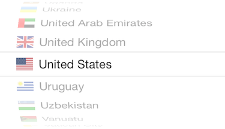

Purpose
--------------

CountryPicker is a custom UIPickerView subclass that provides an iOS control allowing a user to select a country from a list. It can optionally display a flag next to each country name, and the library includes a set of 249 public domain flag images from https://github.com/koppi/iso-country-flags-svg-collection that have been renamed to work with the library.

Note that the list of countries is based on the ISO 3166 country code standard (http://en.wikipedia.org/wiki/ISO_3166-1). This list excludes certain smaller countries, regarding them as part of a larger state. For example, England, Scotland, Wales and Northern Ireland are lumped together as Great Britain. For most purposes this is fine as it matches the convention used for locales, but if you need to specify additional countries, you can subclass and modify the countires list as described under "Subclassing" below.

Supported iOS & SDK Versions
-----------------------------

* Supported build target - iOS 8.1 (Xcode 6.1, Apple LLVM compiler 6.0)
* Earliest supported deployment target - iOS 6.0
* Earliest compatible deployment target - iOS 4.3

NOTE: 'Supported' means that the library has been tested with this version. 'Compatible' means that the library should work on this iOS version (i.e. it doesn't rely on any unavailable SDK features) but is no longer being tested for compatibility and may require tweaking or bug fixes to run correctly.

ARC Compatibility
------------------

As of version 1.1, CountryPicker requires ARC. If you wish to use CountryPicker in a non-ARC project, just add the -fobjc-arc compiler flag to the CountryPicker.m file. To do this, go to the Build Phases tab in your target settings, open the Compile Sources group, double-click CountryPicker.m in the list and type -fobjc-arc into the popover.

If you wish to convert your whole project to ARC, comment out the #error line in CountryPicker.m, then run the Edit > Refactor > Convert to Objective-C ARC... tool in Xcode and make sure all files that you wish to use ARC for (including CountryPicker.m) are checked.

Installation
--------------

To use the CountryPicker in an app, just drag the CountryPicker class files into your project. If you want to use the flag icons, drag the Flags folder in also.

CountryPicker class methods
-----------------------------

The CountryPicker class includes several handy methods for retrieving country names and codes, and converting between the two:

	+ (NSArray *)countryNames;
	
Returns an array of all country names in alphabetical order.
	
	+ (NSArray *)countryCodes;
	
Returns an array of all country codes. The codes are sorted by country name, and their indices match the indices of their respective country name in the `countryNames` list, but note that this means that the codes themselves are not sorted alphabetically.
	
	+ (NSDictionary *)countryNamesByCode;
	
Returns a dictionary of country names, keyed by country code.
	
	+ (NSDictionary *)countryCodesByName;

Returns a dictionary of country codes, keyed by country name.

CountryPicker properties
---------------------------

Each CountryPicker view has the following properties:

	@property (nonatomic, assign) id<CountryPickerDelegate> delegate;
	
The delegate. This implements the CountryPickerDelegate protocol, and is notified when a country is selected.
	
	@property (nonatomic, copy) NSString *selectedCountryName;
	
The currently selected country name. This is a read-write property, so it can be used to set the picker value. Setting the picker to a country name that does not appear in the `countryNames` array has no effect.
	
	@property (nonatomic, copy) NSString *selectedCountryCode;
	
The currently selected country code. This is a read-write property, so it can be used to set the picker value. Setting the picker to a country code that does not appear in the `countryCodes` array has no effect.
	
    @property (nonatomic, copy) NSLocale *selectedLocale;
	
This is a convenience property to set/get the selected country using a locale. The picker will automatically select the correct country based on the local. To default the picker to the current device locale, you can say:

	picker.selectedLocale = [NSLocale currentLocale];

CountryPicker instance methods
----------------------------------

    - (void)setSelectedCountryCode:(NSString *)countryCode animated:(BOOL)animated;
    - (void)setSelectedCountryName:(NSString *)countryName animated:(BOOL)animated;
    - (void)setSelectedLocale:(NSLocale *)locale animated:(BOOL)animated;
    
These methods allow you to set the current country via name, code or locale. THey work excatly like the equivalent property setters, but have an optional animated parameter to make the picker scroll smoothly to the selected country.

CountryPickerDelegate protocol
--------------------------------

The CountryPickerDelegate protocol has a single obligatory method:

	- (void)countryPicker:(CountryPicker *)picker didSelectCountryWithName:(NSString *)name code:(NSString *)code;

This method is called whenever a country is selected in the picker.

Subclassing
------------------

As of version 1.0.2 you can easily subclass CountryPicker to modify the country name/code list.

To add additional countries, override the +countryNamesByCode method (there is no need to override +countryCodesByName as this is derived automatically from +countryNamesByCode).

To change the display order, or display duplicate copies of (say) US or UK at the top of the list, override +countryNames method (there is no need to override +countryCodes as this is derived automatically from +countryNames and +countryCodesByName).

Release notes
------------------

Version 1.2.2

- Added workaround for simulator bug where currentLocale doesn't return country names

Version 1.2.1

- Updated for iOS 8
- Now compliant with -Weverything warning level

Version 1.2

- Removed Countries.plist - country list is now generated automatically
- Country names are now localized
- Added ability to set and get country using locale
- Removed the setWithLocale: method

Version 1.1

- Updated for iOS 7 compatibility
- Added new "flat" flag images for iOS 7
- Now requires ARC (see README for details)
- Now compliant with -Wall and -Wextra warning levels

Version 1.0.2

- Capitalized Japan
- Added South Sudan
- Refactored to make subclassing easier

Version 1.0.1

- Added ARC support
- Added example project

Version 1.0

- Initial release